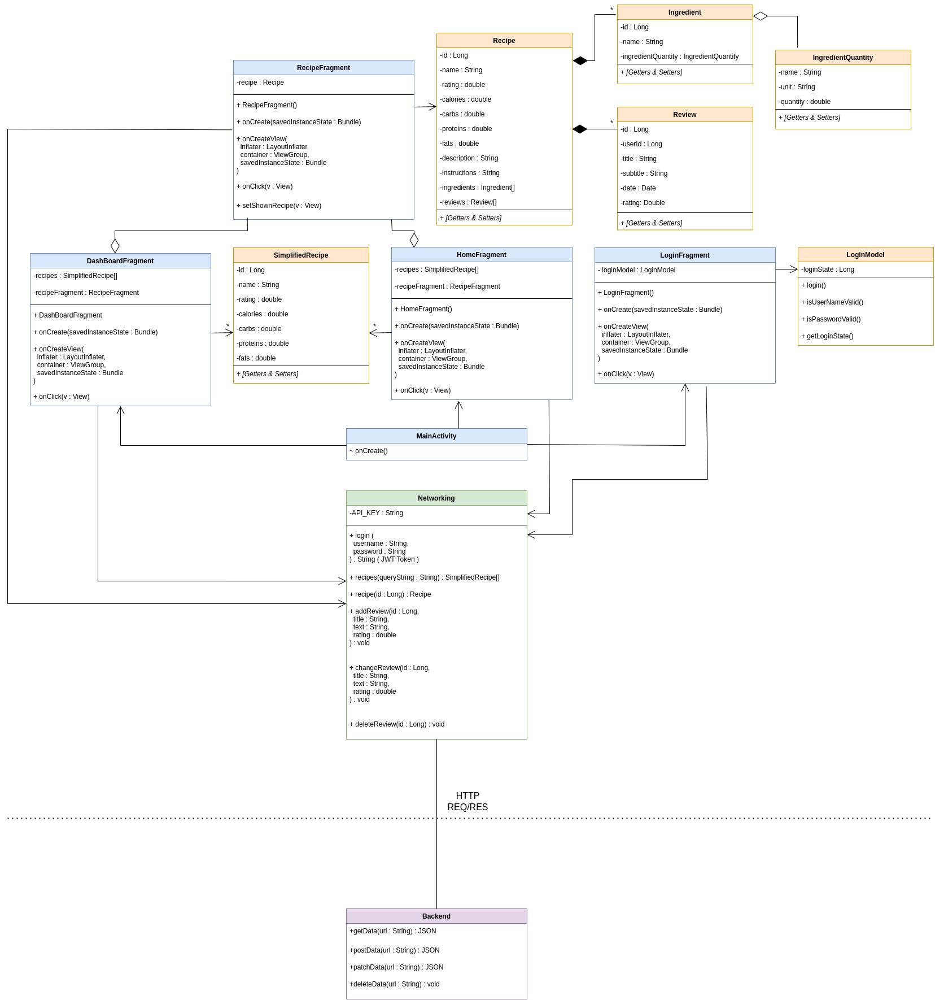
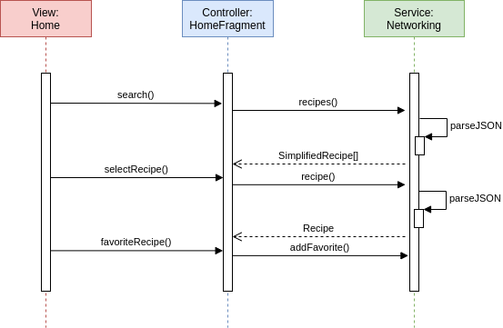
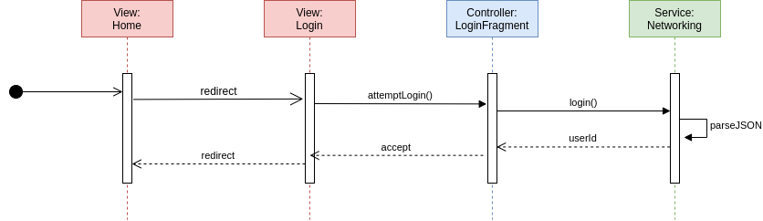
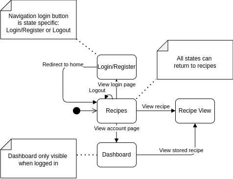

---
geometry: margin=20mm
urlcolor: blue
classoption: table
header-includes: |
    \usepackage{fancyhdr}
    \pagestyle{fancy}
    \lhead{Assignment 2: Design Model}
    \chead{}
    \rhead{HBV601}
...

# Team 16

* Jaan Jaerving - KT: 310191-3539 **( Product Owner )**
* Snorri Steinn Stefánsson Thors - KT: 300895-2639
* Steinunn Ósk Axelsdóttir - KT: 210688-2699
* Valbjörn Jón Valbjörnsson - KT: 100594-2779

## Links

* [Class Diagram](https://notendur.hi.is/jaj20/class.png)
* [State Machine](https://notendur.hi.is/jaj20/state.png)
* [Sequence: Home](https://notendur.hi.is/jaj20/home.png)
* [Sequence: Login](https://notendur.hi.is/jaj20/login.png)

\pagebreak

\pagebreak

\pagebreak

{ width=60% }

